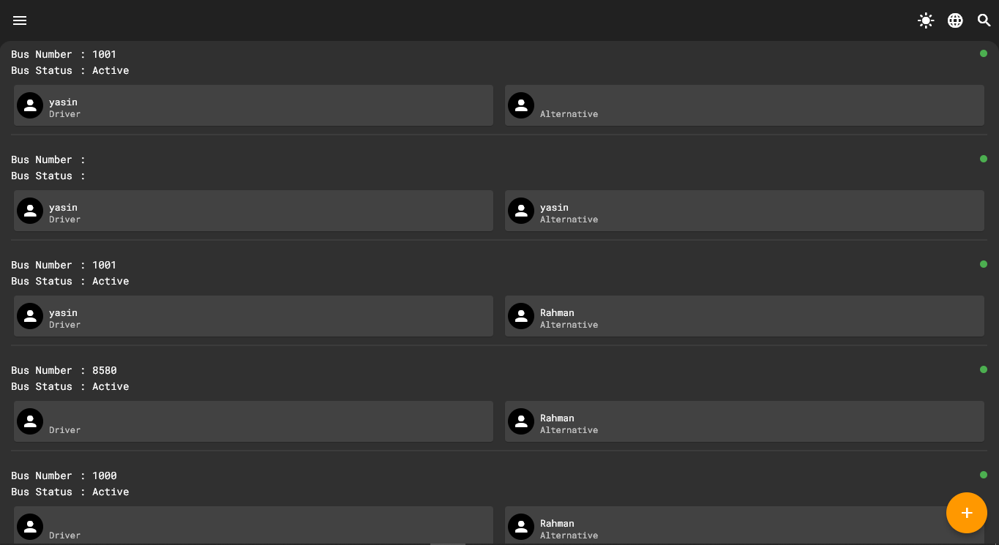
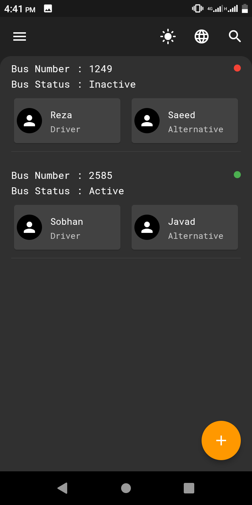
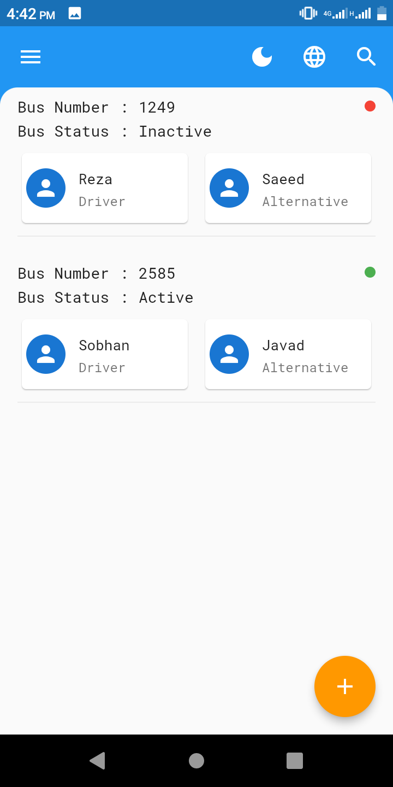

# Bus Information

A managing application for bus organization.  

# Table of contents
* [General info](#general-info)
* [Technologies](#technologies)
* [Launch](#launch)
* [Screenshots](#screenshots)

# General info
Every town has a main bus organization that manage all bus and drivers.  
With the growing town, the number of buses will be increased and managing of this buses become more complicated.  
My goal is to simplify the management of this system.

>### **My motivation ?**
>My friend's dad works in a bus organization as a bus line manager.  
He managed all the drivers and buses by writing their information in a notebook. ( It was a very damn hard way )  
I created this application so he can do his job more easily and faster.

# Technologies

* Flutter 3
* Dart 2.17
* Bloc 8
* Flutter Hive 1.1

# Launch

To run this project, do the steps : 

1. You first need to [install the Flutter](https://docs.flutter.dev/get-started/install) on your system
2. Clone the repository
  ``` 
  $ git clone https://github.com/mrYasinHamidi/bus_information.git 
  ```
3. Get dependencies
  ```
  $ flutter pub get 
  ```
4. Generate Hive adapters 
  ```
  $ flutter packages pub run build_runner build 
  ```
5. Run the project 
  ```
  $ flutter run 
  ```

It is possible to get an error for generator package after step 4.  
If it is , turn off the generate boolean in ``` pubspec.yaml ``` file and try again:
```
flutter:
  generate: false
```
After that turn back on the generate boolean.

# Screenshots


<p float="left">
  
   
</p>
